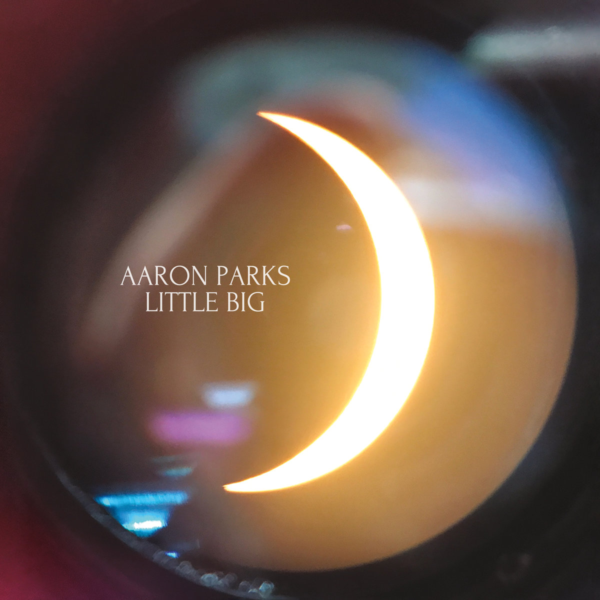
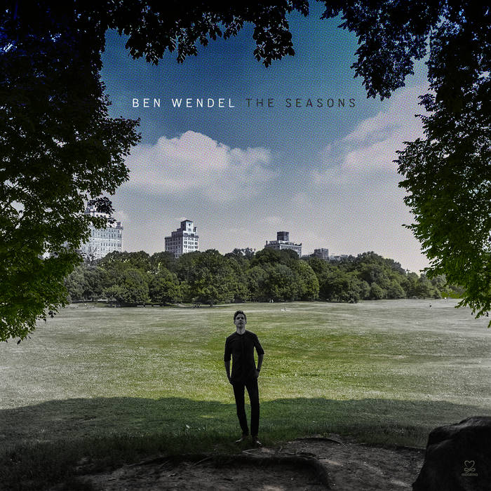
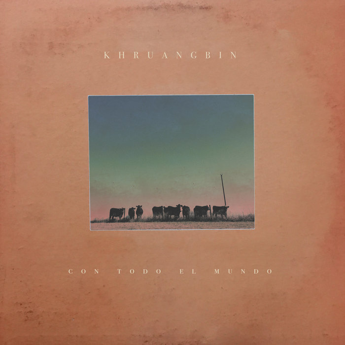
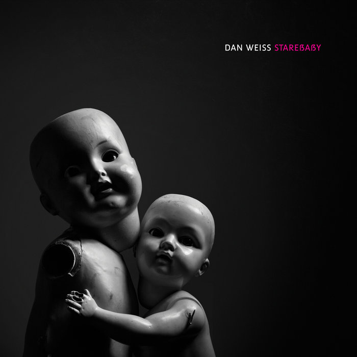
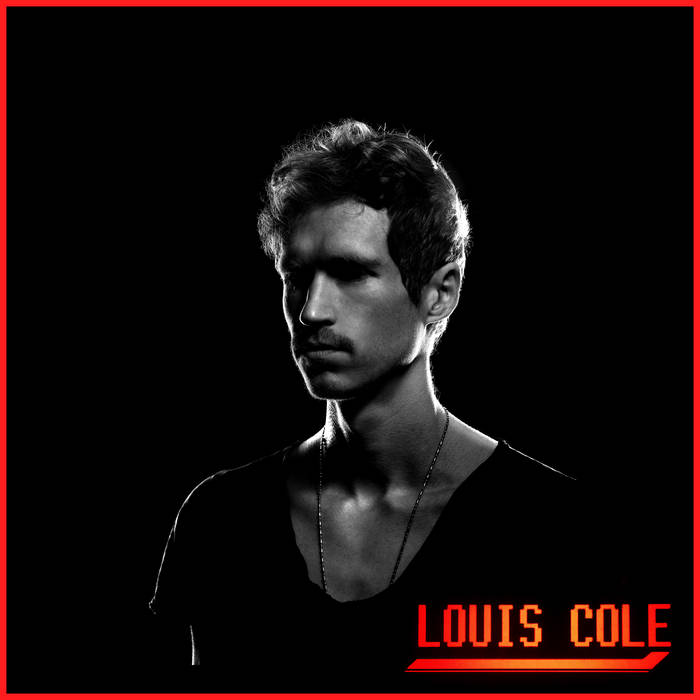
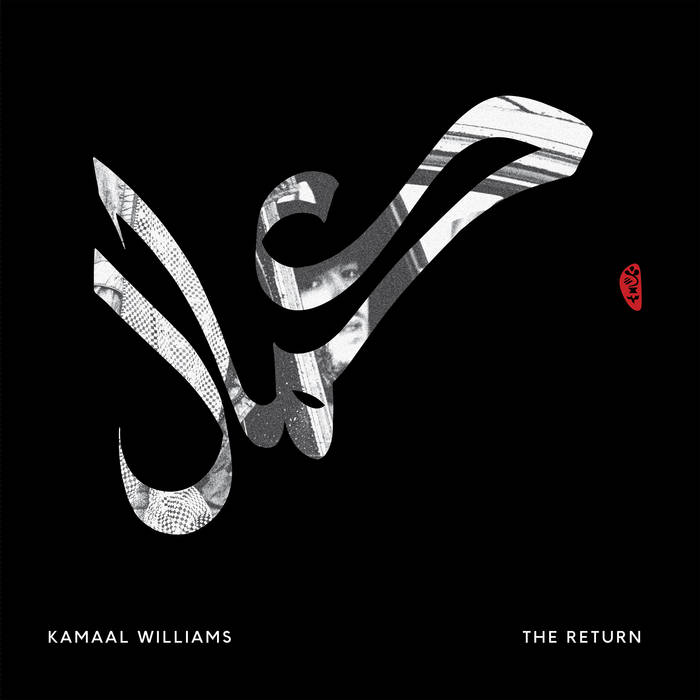

2018 was a great year of listening for me. Releases by artists I already love combined with new discoveries yielded plenty of albums that I've had on loop and will continue to come back to for a while. Here were a few of my favorites:

## Aaron Parks - _Little Big_

When Aaron Parks released _Invisible Cinema_ in 2008, I was a freshman in high school. That album changed my idea of what kind of music a jazz musician could make in the modern age. It was an album that rocked as much as it swung, with melodicism that has continued to be a hallmark of Parks' music and improvisations. _Little Big_ is a sequel of sorts, and it only improves upon the original. Favoring forms and melodies over flashy soloes, each track is its own little world. These range from the brief solo interludes of "Lilac" and "Hearth" to songs like "Kid" and "Professor Strangeweather," which feel just as informed by jammy fusion and rock as they do jazz. At 79 minutes, it's long, but considering its predecessor was a decade earlier, the payoff of that wait is on full display.

[Bandcamp](https://aaronparksmusic.bandcamp.com/album/little-big) | [Spotify](https://open.spotify.com/album/1Ar01FQjqOGYbYgUnpQBsu?si=1HZ90tRfS1a9IvteggtO2g)

## Ben Wendel - _The Seasons_

Already known to me via his role in the group Kneebody and as a saxophonist I generally admire, Ben Wendel released a favorite of mine in 2015 with his project _The Seasons_. Inspired by a Tchaikovsky set of 12 piano pieces with the same name, Wendel wrote 12 duets. Each composition was specifically composed for and performed with a different musical peer, released each month in the form of video live takes (watch the whole series [here](https://www.youtube.com/playlist?list=PLYGtF7cNLhBdQ63_d9YZrZ-SVjjmVXTB9)). It was a nice surprise to see him bring back these compositions in a completely new light, rearranging the duets for a larger quintet comprised of musicians featured throughout the original project. Seeing this band live at Constellation in Chicago was one of my favorite concerts of the year. While all of the tunes are great, my favorite in the larger group is "February," with its bouncy melody that grooves a lot harder with the weight of a full band locking into it.

[Bandcamp](https://benwendel.bandcamp.com/album/the-seasons) | [Spotify](https://open.spotify.com/album/7ghqgjFYnSi2XYdStVTRvv?si=PtDj4cxuTmSHCPKMD9CKaQ)

## Kiefer - _Happysad_

An L.A.-based musician equally versed in beat-making and jazz piano, Kiefer Shackelford gets the most out of this duality on _Happysad_, an album that sounds like the musical baby of Robert Glasper's rich neo-soul and J Dilla's tightest tracks. This is music tailor-made for a joyride, reinforced by track titles like "Highway 46" and "Highway 41" or the [music video](https://www.youtube.com/watch?v=spyMOmC3K20) for "What A Day." 

[Bandcamp](https://kiefer.bandcamp.com/album/happysad) | [Spotify](https://open.spotify.com/album/7t0S1JQpSHsZftfzVQWW2a?si=op1NZSGgQ1qU3eH9rRRQDQ)

## Khruangbin - _Con Todo El Mundo_

Playing a unique blend of soul, surf, psychedelic, and funk that would fit right into the background of a Tarantino-flavored Western, this is an album that creates its own space, with 10 tracks that remain distinct while complementing each other so well. None of the songs try to do too much, excuding a sparseness that feels so good.

[Bandcamp](https://khruangbin.bandcamp.com/album/con-todo-el-mundo-n-s-america-edition) | [Spotify](https://open.spotify.com/album/42j41uUwuHZT3bnedq2XtM?si=uECuKAHhQpySPRvUieY-HA)

## Dan Weiss - _Starebaby_

Oscillating between a myriad of metal influences, electronic music, and the sonic dreamscape of _Twin Peaks_, _Starebaby_ brings an eclectic range of improvisers together for a powerful album. Weiss is a longtime student of tabla and Indian classical, managing to take much of the rhythmic nuances and complexities present in that music and incorporating them into a much heavier and darker sound. Another dense album that rewards repeated listening.

[Bandcamp](https://danweiss.bandcamp.com/album/starebaby) (No streaming for this one, unfortunately)

## Louis Colo - _Time_

While Louis Cole has gained a larger following the past view years – between his synth-pop project KNOWER with Genevieve Artadi and a series of [short songs](https://www.youtube.com/watch?v=dAH4zGd_W1s) going viral – he hadn't released a proper album in 7 years. He's gotten a whole lot better in that time, and it's great to hear that progress in his debut for Flying Lotus' Brainfeeder label. Some of the shorter tracks still feel like filler material to me, but that's more than made up for by catchier songs like "Phone" and "Trying Not To Die."

[Bandcamp](https://louiscole.bandcamp.com/album/time-2) | [Spotify](https://open.spotify.com/album/0WbNyHNpkxpqscNWiiEhZS?si=LCLF3FAsR_itKrJdUglIaA)

## Kamaal Williams - _The Return_

There's a lot of great music coming out of London's jazz scene these days (check out the compilation [We Out Here](https://weouthere.bandcamp.com/), also released in 2018, for a more varied sample). Picking a single record, though, I loved _The Return_, which sounds like Headhunters-era Herbie Hancock stripped of most soloing and doubling down on hypnotic grooves. Whether it's the slow burn of the opener "Salaam", the frenetic syncopation of "Catch The Loop", or the disco flavors of "High Roller", there's plenty of different vamps I couldn't get out of my head.

[Bandcamp](https://kamaalwilliams.bandcamp.com/album/the-return) | [Spotify](https://open.spotify.com/album/3hoqy9LEMxDbv0QBKEBVqQ?si=HAiCHXOGSCqtZuGvbIScAA)

----------

## Honorable Mention

Some others that I liked a lot but haven't dedicated as much listening time to yet:
- **Yves Tumor** - _Safe In The Hands of Love_
- **Makaya McCraven** - _Universal Beings_
- **Jakob Bro** - _Bay Of Rainbows_
- **Sam Wilkes** - _Wilkes_
- **Braxton Cook** - _No Doubt_